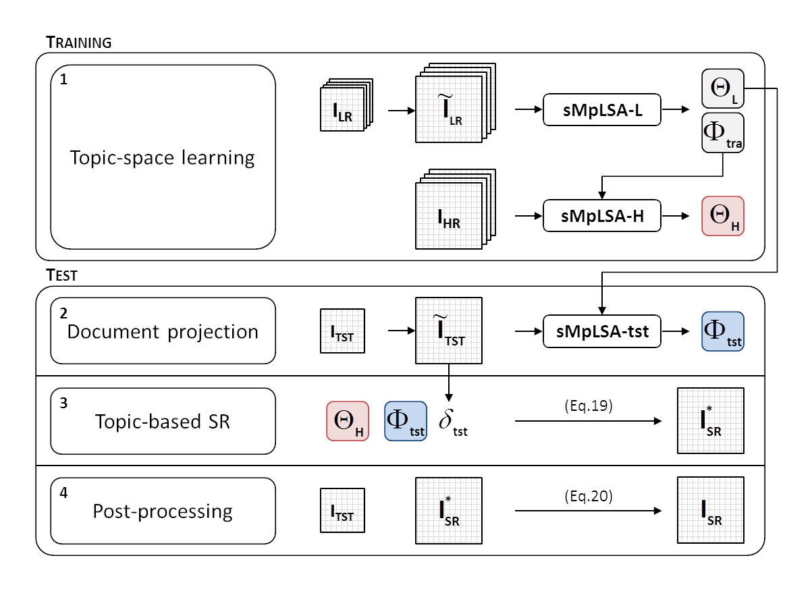

# Sparse multi-modal probabilistic latent semantic analysis for single-image super-resolution

[Ruben Fernandez-Beltran](https://scholar.google.es/citations?user=pdzJmcQAAAAJ&hl=es), [Filiberto Pla](https://scholar.google.es/citations?user=mSSPcAMAAAAJ&hl=es)
---

This repo contains the codes for the paper: [Sparse multi-modal probabilistic latent semantic analysis for single-image super-resolution](https://www.sciencedirect.com/science/article/pii/S0165168418301944). This paper presents a novel single-image super-resolution (SR) approach based on latent topics in order to take advantage of the semantics pervading the topic space when super-resolving images. Image semantics has shown to be useful to relieve the ill-posed nature of the SR problem, however the most accepted clustering-based approach used to define semantic concepts limits the capability of representing complex visual relationships. The proposed approach provides a new probabilistic perspective where the SR process is performed according to the semantics encapsulated by a new topic model, the Sparse Multi-modal probabilistic Latent Semantic Analysis (sMpLSA). Firstly, the sMpLSA model is formulated. Subsequently, a new SR framework based on sMpLSA is defined. Finally, an experimental comparison is conducted using seven learning-based SR methods over three different image datasets. Experiments reveal the potential of latent topics in SR by reporting that the proposed approach is able to provide a competitive performance.





## Usage

(comming soon)

`./codes/smplsa_l/run_pLSA.sh` is the script for running the sMpLSA-L stage of the proposed approach.
`./codes/smplsa_h_tst/run_pLSA.sh` is the script for running the sMpLSA-L and sMpLSA-tst stages of the proposed approach.


## Citation

```
@article{fernandez2018sparse,
  title={Sparse multi-modal probabilistic latent semantic analysis for single-image super-resolution},
  author={Fernandez-Beltran, Ruben and Pla, Filiberto},
  journal={Signal Processing},
  volume={152},
  pages={227--237},
  year={2018},
  publisher={Elsevier}
}
```


## References

[1] Yue, L., Shen, H., Li, J., Yuan, Q., Zhang, H., & Zhang, L. (2016). Image super-resolution: The techniques, applications, and future. Signal processing, 128, 389-408.
